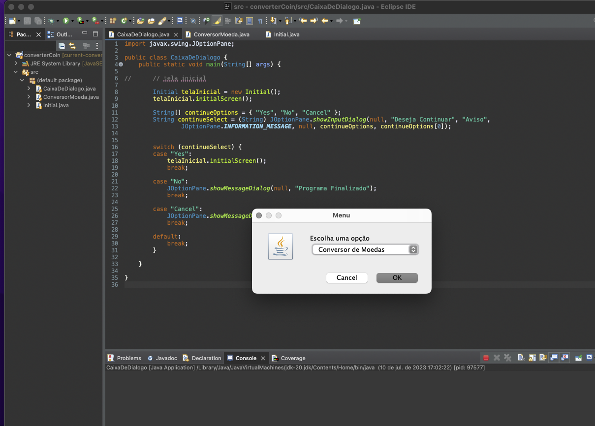

# Conversor diverso

> O projeto é um Conversor de unidades, moedas e é resultado do primeiro desafio do Alura Challenges Oracle ONE da Trilha especial de Java.

### Tecnologias envolvidas

O projeto ainda está em desenvolvimento e as próximas atualizações serão voltadas nas seguintes tarefas:

- [x] Desenvolvimento Conversor de moedas;
- [ ] Conversor de distancias;
- [ ] Conversor de temperatura;

## ☕ Usando Decodificador
Para usar o decodificador, siga estas etapas:

1. Abra o projeto em uma IDE para JAVA;
 2. Execute o arquivo CaixaDeDialogo.

## 🏆 Badge Earn:

## 📫 Contribuindo para Conversor
<!---Se o seu README for longo ou se você tiver algum processo ou etapas específicas que deseja que os contribuidores sigam, considere a criação de um arquivo CONTRIBUTING.md separado--->
Para contribuir com projeto, siga estas etapas:

1. Bifurque este repositório.
2. Crie um branch: `git checkout -b <nome_branch>`.
3. Faça suas alterações e confirme-as: `git commit -m '<mensagem_commit>'`
4. Envie para o branch original: `git push origin <nome_do_projeto> / <local>`
5. Crie a solicitação de pull.

Como alternativa, consulte a documentação do GitHub em [como criar uma solicitação pull](https://help.github.com/en/github/collaborating-with-issues-and-pull-requests/creating-a-pull-request).

#### 😄 Seja um contribuidor 

<!-- Quer fazer parte desse projeto? Clique [AQUI](CONTRIBUTING.md) e leia como contribuir. -->

<!-- ## 📝 Licença

Esse projeto está sob licença. Veja o arquivo [LICENÇA](LICENSE.md) para mais detalhes. -->
